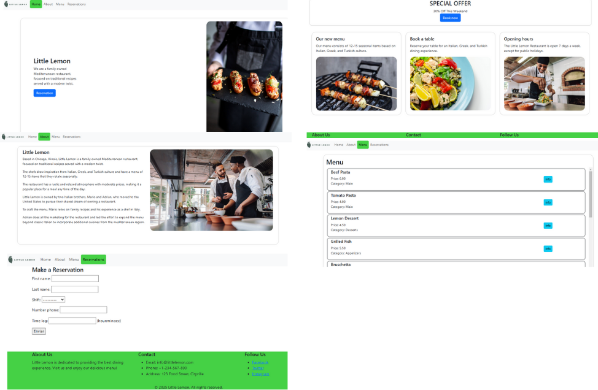

# Little Lemon Web Page

This project uses Django to build a web application and RESTful API for Little Lemon, a local bistro. The web app includes five main pages— Home, About, Reservation, Menu— to engage customers and highlight the restaurant’s offerings. The API allows developers to manage menu items, process orders, and assign delivery staff, with role-based access control. Together, these components enhance Little Lemon’s digital presence and streamline operations for a better customer experience.

### First Part

